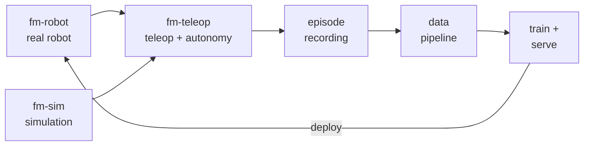

# First Motive

**Ground-truth infrastructure for Physical AI.**

The data engine that turns off-the-shelf robots into deployment-grade workers.
Open schemas. Public benchmarks. Built from South Africa.

## What We Do

Every AI breakthrough has been a data story. Physical AI has no data. We produce
it — and build the infrastructure that makes it reusable.

Our stack runs a single loop: drive a robot (real or simulated), record what it
does as structured episodes, train policies on that data, then deploy the
policies back to the robot. Each layer is its own repository, assembled into one
ROS2 (Humble) workspace.

`fm-app` orchestrates bringup across these layers; `fm-ros2` is the workspace
that assembles them all.

## The Stack

### Robot Stack

| Repo | What it does |
|------|--------------|
| [`fm-robot`](https://github.com/first-motive/fm-robot) | Robot layer: URDF description, controllers, sensor drivers |
| [`fm-teleop`](https://github.com/first-motive/fm-teleop) | Teleop layer: every teleop input behind one command contract |
| [`fm-sim`](https://github.com/first-motive/fm-sim) | Simulation layer: headless dev loop, backend hosts, MJCF model registry |
| [`fm-app`](https://github.com/first-motive/fm-app) | Application layer: bringup launch orchestration + operator TUI |

### Workspace

| Repo | What it does |
|------|--------------|
| [`fm-ros2`](https://github.com/first-motive/fm-ros2) | Orchestrator: assembles the per-package repos into one colcon workspace via vcs, plus shared tooling (Docker, dev container, CI) and full-system docs |

## Get In Touch

- Website — [firstmotive.ai](https://firstmotive.ai)
- Email — [adii@firstmotive.ai](mailto:adii@firstmotive.ai)
- Based — Stellenbosch, South Africa

From the team behind WooCommerce, applying open-infrastructure thinking to the data layer of Physical AI.
