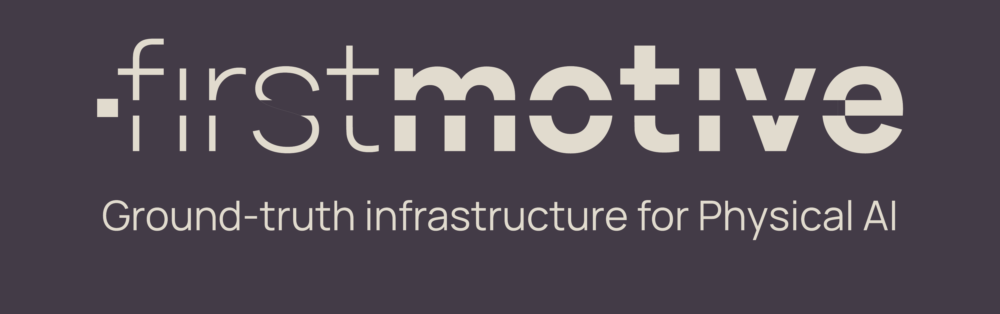
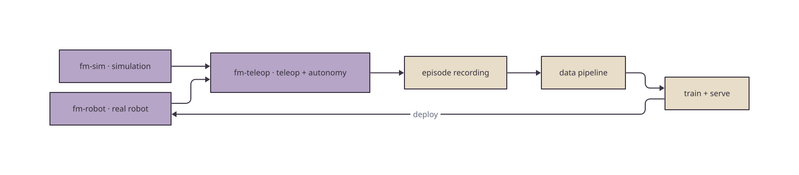

<p align="center">
  
</p>

The data engine that turns off-the-shelf robots into deployment-grade workers.
Open schemas. Public benchmarks. Built from South Africa.

## What We Do

Every AI breakthrough has been a data story. Physical AI has no data. We produce
it — and build the infrastructure that makes it reusable.

Our stack runs a single loop: drive a robot (real or simulated), record what it
does as structured episodes, train policies on that data, then deploy the
policies back to the robot. Each layer is its own repository, assembled into one
ROS2 workspace.

<p align="center">
  
</p>

<sub>Diagram source: [`diagrams/architecture.d2`](diagrams/architecture.d2) — re-render with [`diagrams/render.sh`](diagrams/render.sh), which the render plane keeps in step with every other repo's.</sub>

`fm-app` orchestrates bringup across these layers; `fm-ros2` is the workspace
that assembles them all.

## Get Started

`fm-ros2` is the single entryway. One command clones the workspace, assembles
every layer from its manifests, and sets up the viewer:

```bash
curl -fsSL https://raw.githubusercontent.com/first-motive/fm-ros2/main/install.sh | bash
cd fm_ros2 && ./run.sh
```

Prefer to read before you run:

```bash
curl -fsSL https://raw.githubusercontent.com/first-motive/fm-ros2/main/install.sh -o install.sh
less install.sh && bash install.sh
```

Install and run are split on purpose: install is non-interactive and safe to
pipe, while `run.sh` drives the interactive TUI from your terminal. The package
repos are private, so the import step assumes org access and fails with a clear
message without it.

## The Stack

### Robot Stack

| Repo | What it does | Name | Username | Email |
|------|--------------|------|----------|-------|
| [`fm-robot`](https://github.com/first-motive/fm-robot) | Robot layer: URDF description, controllers, sensor drivers | Nishalan Govender | [@ubunish](https://github.com/ubunish) | [nish@ubundi.co.za](mailto:nish@ubundi.co.za) |
| [`fm-teleop`](https://github.com/first-motive/fm-teleop) | Teleop layer: every teleop input behind one command contract | Wynand Neethling<br>Retief Louw | [@WynandNeethling](https://github.com/WynandNeethling)<br>[@RetiefLouw](https://github.com/RetiefLouw) | [wynand@ubundi.co.za](mailto:wynand@ubundi.co.za)<br>[retief@ubundi.co.za](mailto:retief@ubundi.co.za) |
| [`fm-sim`](https://github.com/first-motive/fm-sim) | Simulation layer: headless dev loop, backend hosts, MJCF model registry | Nishalan Govender | [@ubunish](https://github.com/ubunish) | [nish@ubundi.co.za](mailto:nish@ubundi.co.za) |
| [`fm-app`](https://github.com/first-motive/fm-app) | Application layer: bringup launch orchestration + operator TUI | Nishalan Govender<br>Matthew Schramm | [@ubunish](https://github.com/ubunish)<br>[@Schramm2](https://github.com/Schramm2) | [nish@ubundi.co.za](mailto:nish@ubundi.co.za)<br>[matthew@ubundi.co.za](mailto:matthew@ubundi.co.za) |

### Workspace

| Repo | What it does | Name | Username | Email |
|------|--------------|------|----------|-------|
| [`fm-ros2`](https://github.com/first-motive/fm-ros2) | Orchestrator: assembles the per-package repos into one colcon workspace via vcs, plus shared tooling (Docker, dev container, CI) and full-system docs | Nishalan Govender | [@ubunish](https://github.com/ubunish) | [nish@ubundi.co.za](mailto:nish@ubundi.co.za) |

## Get In Touch

- Website — [firstmotive.ai](https://firstmotive.ai)
- Email — [adii@firstmotive.ai](mailto:adii@firstmotive.ai)
- Based — Stellenbosch, South Africa

<sub>From the team behind WooCommerce, applying open-infrastructure thinking to the data layer of Physical AI.</sub>
